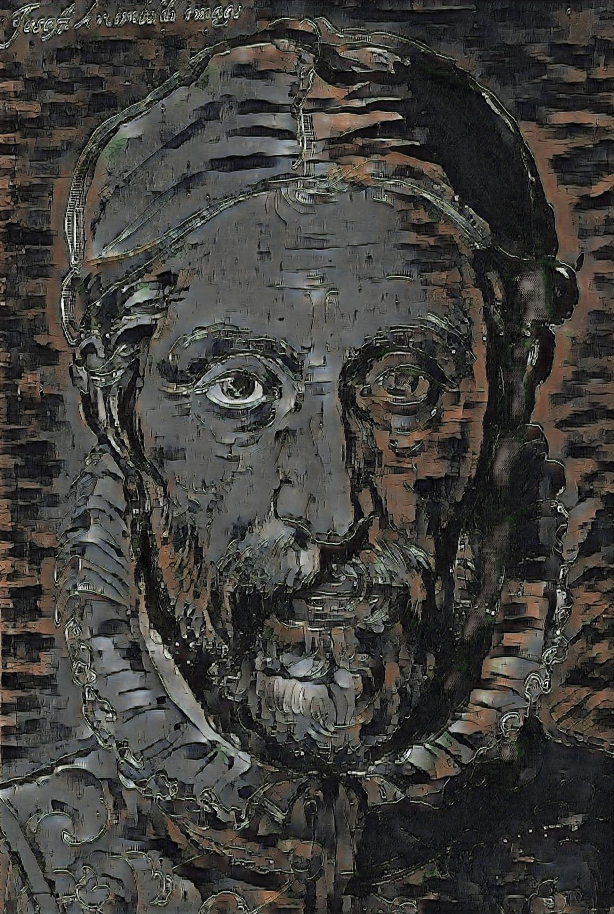
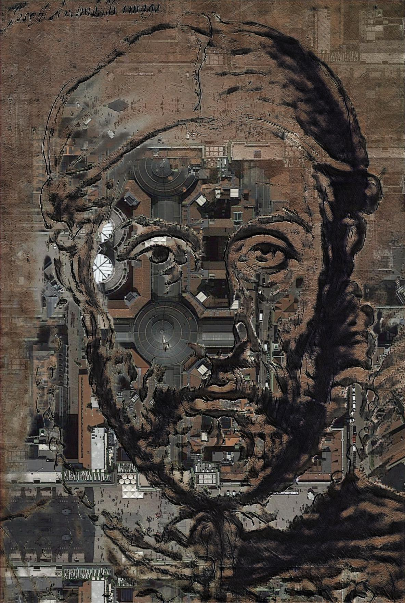
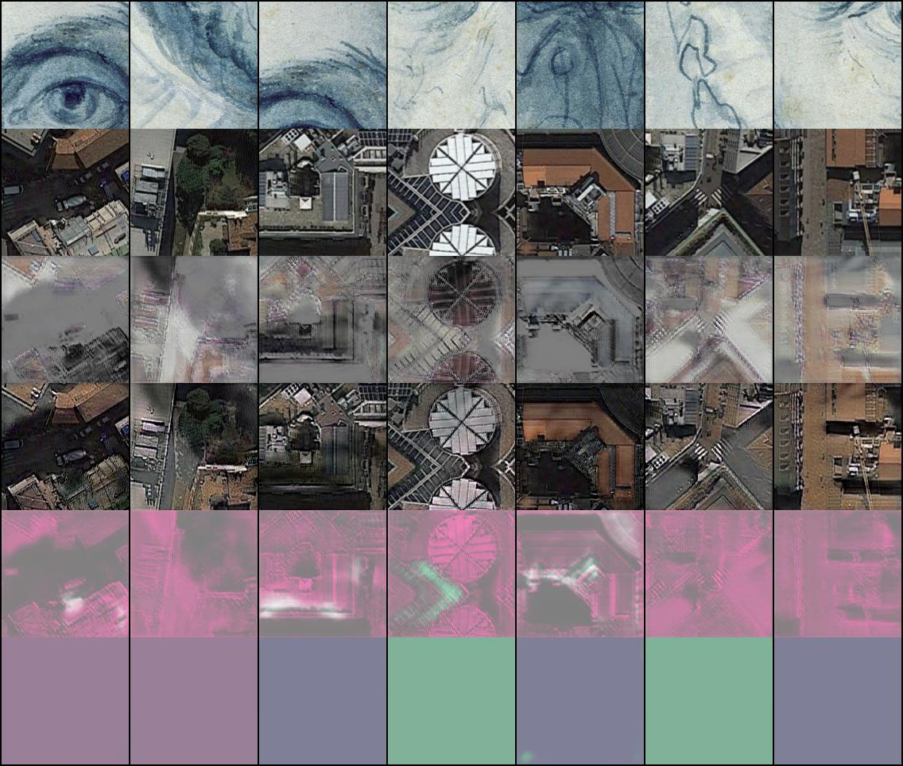

# Fully Adversarial Mosaics (FAMOS)

Pytorch implementation of the paper "Copy the Old or Paint Anew? An Adversarial Framework
for (non-) Parametric Image Stylization" available at http://arxiv.org/abs/1811.09236.

This code allows to generate image stylisation using an adversarial approach combining parametric and non-parametric elements.
Tested to work on Ubuntu 16.04, Pytorch 0.4, Python 3.6. Nvidia GPU p100. It is recommended to have a GPU with 12, 16GB, or more of VRAM.


## Parameters
Our method has many possible settings. You can specify them with command-line parameters. The options parser that defines these parameters is in the `config.py` file and the options are parsed there.
You are free to explore them and discover the functionality of FAMOS, which can cover a very broad range of image stylization settings.

There are 5 groups of parameter types:
- data path and loading parameters
- neural network parameters
- regularization and loss criteria weighting parameters
- optimization parameters 
- parameters of the stochastic noise -- see [PSGAN](https://arxiv.org/abs/1705.06566)

## Update Febr. 2019: video frame-by-frame rendering supported
mosaicGAN.py can now render a whole folder of test images with the trained model.
Example videos: lion video with [Münich](https://www.youtube.com/watch?v=pB08N6Vq-hM&feature=youtu.be) and [Berlin](https://www.youtube.com/watch?v=Nl2fwIQk4u4&feature=youtu.be)


Just specify
```
python mosaicGAN.py --texturePath=samples/milano/ --contentPath=myFolder/ --testImage=myFolder/ 
```

with your myFolder and all images from that folder will be rendered by the generator of the GAN. Best to use the same test folder as content folder for training.
To use in a video editing pipeline, save all video frames as images with a tool like AVIDEMUX, train FAMOS and save rendered frames, assemble again as video. 
Note: this my take some time to render thousands of images, you can edit in the code VIDEO_SAVE_FREQ to render the test image folder less frequently.

## Update Jan. 2019: new functionality for texture synthesis
Due to interest in a new Pytorch implementation of our last paper "Texture Synthesis with Spatial Generative Adversarial Networks" ([PSGAN](https://arxiv.org/abs/1705.06566)) we added a script reimplementing it in the current repository. It shares many components with the texture mosaic stylization approach. A difference: PSGAN has no content image and loss, the generator is conditioned only on noise.
Example call for texture synthesis:

```
python PSGAN.py --texturePath=samples/milano/ --ngf=120 --zLoc=50 --ndf=120 --nDep=5 --nDepD=5 --batchSize=16
```

In general, texture synthesis is much faster than the other methods in this repository, so feel free to add more channels and increase th batchsize.
For more details and inspiration how to play with texture synthesis see our [old repository](https://github.com/zalandoresearch/psgan) with Lasagne code for PSGAN. 


## Usage: parametric convolutional adversarial mosaic
We provide scripts that have a main loop in which we (i) train an adversarial stylization model and (ii) save images (inference mode). If you need it, you can easily modify the code to save a trained model and load it later to do inference on many other images, see comments at the end of `mosaicGAN.py`.

In the simplest case, let us start an adversarial mosaic using convolutional networks. All you need is to specify the texture and content folders:

```
python mosaicGAN.py --texturePath=samples/milano/ --contentPath=samples/archimboldo/
```

This repository includes sample style files (4 satellite views of Milano, from Google Maps) and a portrait of Archimboldo (from the Google Art Project).
Our GAN method will start running and training, occasionally saving results in "results/milano/archimboldo/" and printing the loss values to the terminal. Note that we use the first image found in `contentPath` as the default full-size output image stylization from FAMOS.
You can also specify another image file name `testImage` to do out-of-sample stylization (inference).

This version uses DCGAN by default, which works nicely for the convolutional GAN we have here. Add the parameter `LS` for a least squares loss, which also works nicely. Interestingly, WGAN-GP is poorer for our model, which we did not investigate in detail.

If you want to tune the optimisation and model, you can adjust the layers and channels of the Generator and Discriminator, and also choose `imageSize` and `batchSize`. All this will effect the speed and performance of the model. You can also tweak the correspondance map `cLoss` and the content loss weighting `fContent`

```
python mosaicGAN.py --texturePath=samples/milano/ --contentPath=samples/archimboldo/ --imageSize=192 --batchSize=8 --ngf=80 --ndf=80  --nDepD=5  --nDep=4 --cLoss=101 --fContent=.6
```

Other interesting options are `skipConnections` and `Ubottleneck`. By disabling the skip connections of the Unet and defining a smaller bottleneck we can reduce the effect of the content image and emphasize more the texture style of the output.




## Usage: the full FAMOS approach with parametric and non-parametric aspects
Our method has the property of being able to copy pixels from template images together with the convolutional generation of the previous section.

```
python mosaicFAMOS.py  --texturePath=samples/milano/ --contentPath=samples/archimboldo/ --N=80 --mirror=True --dIter=2 --WGAN=True
```

Here we specify `N=80` memory templates to copy from. In addition, we use `mirror` augmentation to get nice kaleidoscope-like effects in the template (and texture distribution).
We use the `WGAN` GAN criterium, which works better for the combined parametric/non-parametric case (experimenting with the usage of DCGAN and WGAN depending on the architecture is advised). We set to use `dIter=2` D steps for each G step.

The code also supports a slightly more complicated implementation than the one described in the paper.
By setting `multiScale=True` a mixed template of images I_M on multiple levels of the Unet is used. 
In addition, by setting `nBlocks=2` we will add residual layers to the decoder of the Unet, for a model with even higher capacity.
Finally, you can also set `refine=True` and add a second Unet to refine the results of the first one. Of course, all these additional layers come at a computational cost -- selecting the layer depth, channel width, and the use of all these additional modules is a matter of trade-off and experimenting. 

```
python mosaicFAMOS.py  --texturePath=samples/milano/ --contentPath=samples/archimboldo/ --N=80 --mirror=True --multiScale=True --nBlocks=1 --dIter=2 --WGAN=True
```



The method will save mosaics occasionally, and optionally you can specify a `testImage` (size smaller than the initial content image) to check out-of-sample performance.
You can check the patches image saved regularly how the patch based training proceeds.
The files has a column per batch-instance, and 6 rows showing the quantities from the paper:

- I_C content patch
- I_M mixed template patch on highest scale
- I_G parametric generation component
- I blended patch
- \alpha blending mask
- A mixing matrix




## License
Please make sure to cite/acknowledge our paper, if you use any of the contained code in your own projects or publication.


The MIT License (MIT)

Copyright © 2018 Zalando SE, https://tech.zalando.com

Permission is hereby granted, free of charge, to any person obtaining a copy
of this software and associated documentation files (the "Software"), to deal
in the Software without restriction, including without limitation the rights
to use, copy, modify, merge, publish, distribute, sublicense, and/or sell
copies of the Software, and to permit persons to whom the Software is
furnished to do so, subject to the following conditions:

The above copyright notice and this permission notice shall be included in all
copies or substantial portions of the Software.

THE SOFTWARE IS PROVIDED "AS IS", WITHOUT WARRANTY OF ANY KIND, EXPRESS OR
IMPLIED, INCLUDING BUT NOT LIMITED TO THE WARRANTIES OF MERCHANTABILITY,
FITNESS FOR A PARTICULAR PURPOSE AND NONINFRINGEMENT. IN NO EVENT SHALL THE
AUTHORS OR COPYRIGHT HOLDERS BE LIABLE FOR ANY CLAIM, DAMAGES OR OTHER
LIABILITY, WHETHER IN AN ACTION OF CONTRACT, TORT OR OTHERWISE, ARISING FROM,
OUT OF OR IN CONNECTION WITH THE SOFTWARE OR THE USE OR OTHER DEALINGS IN THE
SOFTWARE.
